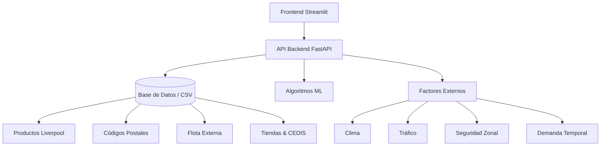

# 🚀 Logistics Intelligence Platform

**Plataforma avanzada de inteligencia logística para la optimización de entregas y toma de decisiones estratégicas en tiempo real.**

---

## 📋 Descripción

La **Logistics Intelligence Platform** es una aplicación web desarrollada en **Streamlit** que ofrece análisis predictivo y optimización de rutas logísticas para *Liverpool*. Combina algoritmos de *Machine Learning* y análisis de datos en tiempo real para evaluar múltiples escenarios de entrega considerando inventario, distancia, costo, clima, tráfico y seguridad zonal.

### 🎯 Características principales

* **🤖 Análisis Predictivo** – Algoritmos ML para optimización de rutas.
* **🗺️ Visualización Interactiva** – Grafos dinámicos de la red logística.
* **📊 Escenarios Múltiples** – Evaluación comparativa de alternativas de entrega.
* **🌍 Factores Externos** – Integración de clima, tráfico y seguridad.
* **🏭 Gestión de CEDIS** – Optimización vía centros de distribución.
* **📈 Dashboard Ejecutivo** – KPIs y métricas en tiempo real.

---

## 🏗️ Arquitectura del sistema



### 🔗 Conectividad backend

**Endpoint principal**

```http
POST http://0.0.0.0:8000/api/v1/fee/predict
```

**Payload de ejemplo**

```json
{
  "codigo_postal": "05050",
  "sku_id": "LIV-002",
  "cantidad": 1,
  "fecha_compra": "2025-06-18T11:00:00"
}
```

---

## 🚀 Instalación y configuración

### Prerrequisitos

* Python 3.8 o superior
* `pip`
* Backend API activo en el puerto **8000**

### 1. Clonar el repositorio

```bash
git clone <repository-url>
cd logistics-intelligence-platform
```

### 2. Instalar dependencias

```bash
pip install -r requirements.txt  # recomendado
# o bien
pip install streamlit pandas plotly streamlit-echarts requests
```

### 3. Configurar el backend

Edita `config/settings.py`:

```python
class Config:
    API_BASE_URL = "http://0.0.0.0:8000"  # Cambia por tu URL
    API_PREDICT_ENDPOINT = "/api/v1/fee/predict"
    API_TIMEOUT = 30  # segundos
```

### 4. Ejecutar la aplicación

```bash
streamlit run app.py
```

La aplicación estará disponible en `http://localhost:8501`.

---

## 📁 Estructura del proyecto

```text
logistics-intelligence-platform/
├── app.py                    # Aplicación principal
├── components/
│   ├── layout.py             # Configuración de página y CSS
│   ├── forms.py              # Formularios de entrada
│   └── charts.py             # Visualizaciones y gráficos
├── config/
│   └── settings.py           # Configuración global
├── services/
│   └── api_client.py         # Cliente para API backend
├── styles/
│   └── custom.css            # Estilos personalizados
├── utils/
│   └── helpers.py            # Funciones auxiliares
└── README.md
```

---

## 🔄 Tipos de respuesta del backend

### 1. 📦 Respuesta simple (`single_delivery_date`)

```json
{
  "tipo_respuesta": "single_delivery_date",
  "resultado_final": {
    "tipo_entrega": "EXPRESS",
    "fecha_entrega_estimada": "2025-06-19T14:00:00",
    "costo_mxn": 50.0,
    "probabilidad_exito": 0.81
  }
}
```

### 2. 🔄 Múltiples opciones (`multiple_delivery_dates`)

```json
{
  "tipo_respuesta": "multiple_delivery_dates",
  "multiple_delivery_options": true,
  "delivery_options": [
    {
      "opcion": "entrega_consolidada",
      "descripcion": "51 unidades consolidadas en hub CDMX",
      "costo_envio": 4865.6,
      "probabilidad_cumplimiento": 0.85
    }
  ]
}
```

### 3. 🏭 Ruta compleja vía CEDIS (`compleja_cedis`)

```json
{
  "logistica_entrega": {
    "tipo_ruta": "compleja_cedis",
    "cedis_intermedio": "CEDIS Culiacán"
  },
  "evaluacion_detallada": {
    "cedis_analysis": {
      "cedis_seleccionado": {
        "nombre": "CEDIS Culiacán",
        "score": 11.43
      }
    }
  }
}
```

---

## 📊 Funcionalidades principales

1. **Formulario de predicción**

   * Entrada de código postal, SKU, cantidad y fecha.
   * Validación en tiempo real con ejemplos precargados.

2. **Visualización de redes**

   * Grafos interactivos (ECharts) mostrando relaciones CP → Tiendas → CEDIS → Destino.

3. **Dashboard de resultados**

   * Métricas clave: costo, tiempo, probabilidad, distancia.
   * Análisis de factores externos.

4. **Análisis detallado**

   * Desglose por stock, CEDIS, factores externos y costos.
   * Justificación de la ruta ganadora.

---

## 🎨 Personalización

### Paleta de colores

Edita `styles/custom.css` **o** `config/settings.py`:

```python
# Paleta corporativa
PRIMARY_COLOR  = "#1e40af"  # Azul corporativo
SUCCESS_COLOR  = "#10b981"  # Verde éxito
WARNING_COLOR  = "#f59e0b"  # Ámbar
ERROR_COLOR    = "#ef4444"  # Rojo alerta
```

### Colores para nodos/gráficos

```python
GRAPH_COLORS = {
    "destination": "#1e40af",
    "product": "#0ea5e9",
    "store_with_stock": "#10b981",
    "cedis": "#6366f1",
    "factors": "#f59e0b",
}
```

---

## 🔧 Detalle de la API

### Parámetros de entrada

| Campo           | Tipo    | Descripción               | Ejemplo               |
| --------------- | ------- | ------------------------- | --------------------- |
| `codigo_postal` | string  | CP de destino (5 dígitos) | "05050"               |
| `sku_id`        | string  | ID del producto           | "LIV-002"             |
| `cantidad`      | integer | Unidades solicitadas      | 1                     |
| `fecha_compra`  | string  | Fecha ISO 8601 del pedido | "2025-06-18T11:00:00" |

### Estructura de respuesta genérica

> Nota: El siguiente bloque usa **JSON con comentarios** (`jsonc`) para mayor claridad.

```jsonc
{
  "request": { /* datos del request */ },
  "producto": { /* información del producto */ },
  "factores_externos": { /* clima, tráfico, etc. */ },
  "evaluacion_detallada": {
    "stock_analysis": {},
    "cedis_analysis": {}
  },
  "logistica_entrega": {},
  "resultado_final": {},
  "tipo_respuesta": "single_delivery_date | multiple_delivery_dates"
}
```

---

## 📱 Uso paso a paso

1. **Iniciar análisis**

   * Ingresa el CP de destino.
   * Selecciona el SKU y la cantidad.
   * Define la fecha y hora de compra.

2. **Revisar resultados**

   * Dashboard con métricas clave y fecha promesa.
   * Red logística interactiva.

3. **Interpretar insights**

   * Probabilidad de éxito y riesgos.
   * Costos y tiempos comparativos.

---

## 🚨 Troubleshooting

| Síntoma                    | Causa probable                           | Solución                                                           |
| -------------------------- | ---------------------------------------- | ------------------------------------------------------------------ |
| **🔌 Conexión rechazada**  | Backend inactivo                         | Asegúrate de que el API esté corriendo en *localhost:8000*.        |
| **⏰ Timeout**              | Respuesta lenta del API                  | Incrementa `API_TIMEOUT` o revisa la carga del servidor.           |
| **⚠️ Datos insuficientes** | El backend no devolvió ciertas secciones | Verifica que `stock_analysis` y campos requeridos estén presentes. |

**Debug rápido en Streamlit**

```python
import streamlit as st

# `response` es la respuesta del backend (objeto requests.Response)
response_json = response.json()

if st.checkbox("📄 Mostrar response completo"):
    st.json(response_json)
```

---

## 🚀 Roadmap

* 🗺️ Mapas geográficos interactivos.
* 📱 Versión *mobile first*.
* 🤖 Asistente conversacional.
* 📊 Exportación a PDF.
* 🔔 Alertas en tiempo real.
* 🌐 Multi‑idioma.
* ⚡ Cache de respuestas.
* 🔐 Autenticación y permisos.
* 🧪 Testing automatizado.

---

## 🤝 Contribución

1. Haz *fork* del repo.
2. Crea una rama: `git checkout -b feature/mi-feature`.
3. Commitea tus cambios.
4. *Push* y abre un Pull Request.

### Estándares de código

* PEP 8 y *docstrings*.
* *Type hints*.
* Pruebas unitarias para nuevas funcionalidades.

---

## 📄 Licencia

Este proyecto se distribuye bajo la licencia **MIT**. Consulta `LICENSE` para más información.

---

## 👥 Créditos

| Rol                        | Nombre            | Contacto                                                          |
| -------------------------- | ----------------- | ----------------------------------------------------------------- |
| Lead Developer & Architect | **Iván Martínez** | [imartinezt@liverpool.com.mx](mailto:imartinezt@liverpool.com.mx) |

### Stack tecnológico

* **Frontend** – Streamlit, Plotly, ECharts.
* **Backend** – FastAPI, Python, ML.
* **Datos** – Pandas, CSV, APIs externas.

---

## 📞 Soporte

* **Email** – [imartinezt@liverpool.com.mx](mailto:imartinezt@liverpool.com.mx)
* **Issues** – Usa la sección de *Issues* en GitHub.

---

> **Versión** 3.0.0 — *Última actualización*: junio 2025

---

**Desarrollo creado e implementado por Iván Martínez**
